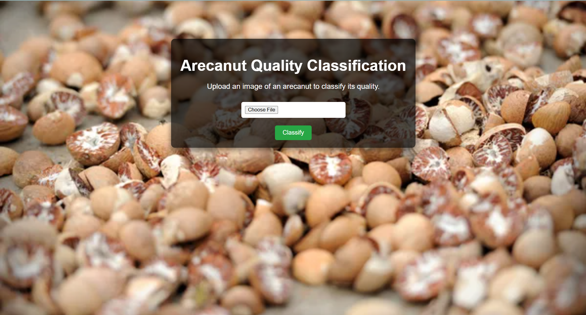

# 🌰 Arecanut Quality Classifier using Random Forest

This is a Flask-based web app that classifies **arecanut quality** as **High**, **Medium**, or **Low** from an uploaded image. It uses a **Random Forest** classifier trained on image features extracted via OpenCV.

---

## 🚀 Features

- ✅ Upload and classify arecanut images  
- ✅ Outputs quality class with confidence score  
- ✅ Clean and responsive web interface  
- ✅ Works locally without internet  

---

## 📂 Folder Structure

arecanut_classifier/
├── dataset
│ └──high
│ └──medium
│ └──low
├── app.py # Flask web server
├── model_training.py # Script to train the Random Forest model
├── arecanut_model.pkl # Trained model file
├── requirements.txt
├── README.md
├── screenshot.png # UI preview
├── static/
│ └── css/
│ └── style.css
│ └──images/
│ └──bg.jpg
│ └──bg1.jpg
├── templates/
│ ├── index.html
│ └── result.html

---

## 🧠 Tech Stack

- Python 3  
- Flask  
- scikit-learn (Random Forest)  
- OpenCV  
- HTML/CSS (for frontend)

---

## ▶️ How to Run

### 1. Install Dependencies

pip install -r requirements.txt

2. Run the App

python app.py

Then open your browser and go to:
http://127.0.0.1:5000/

3. Upload & Predict
Upload an arecanut image (JPEG/PNG)

Get the predicted class: High, Medium, or Low

View confidence percentage

📸 Screenshot

🛠️ Future Improvements
🔁 Replace Random Forest with CNN for better accuracy

🌐 Deploy on Render, Railway, or HuggingFace Spaces

📊 Add graphical confidence visualization (bar chart or pie)

📂 Support image upload history/logging

📌 Notes
The model expects images resized to 64×64 during training

You can retrain using model_training.py and replace arecanut_model.pkl

Be sure to keep uploaded images in a clean folder like static/images

📄 License
MIT License
